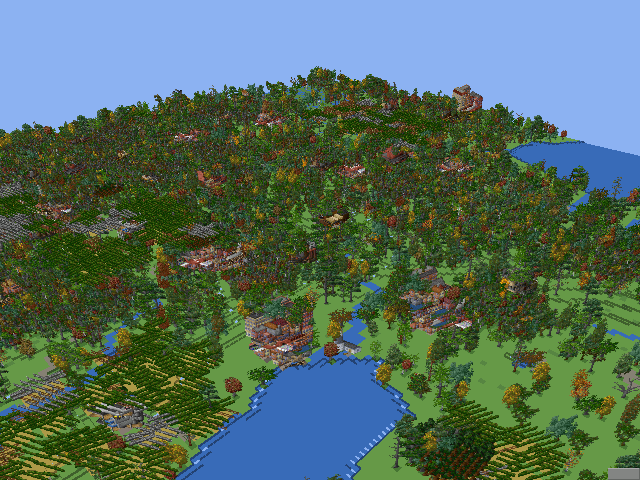

# OpenTTD 3D

> [!CAUTION]
> ## ⚠️ EARLY EXPERIMENT — NOT STABLE
>
> **This project is an early, experimental prototype.**
> - It is **not stable**: expect crashes, rendering glitches, broken features and missing functionality.
> - It is **not a release**, not a beta, and not production-ready in any form.
> - Everything here may change, break or be removed at any time.
> - **Do not rely on this for anything** — use the [official OpenTTD](https://github.com/OpenTTD/OpenTTD) for actual gameplay.
>
> 

> 
> 
> 

Experimental 3D camera and depth rendering for [OpenTTD](https://github.com/OpenTTD/OpenTTD).

This is a fork that modifies the real OpenTTD rendering pipeline — not a separate viewer or a mod. The camera looks at the map with a real perspective (vanishing point), and sprites shrink continuously with their distance from the camera. Gameplay logic is untouched.

*Stage 3 orbit view: the ground is a real 3D heightfield mesh, and trees,
roads and buildings are drawn as camera-facing billboards across the whole
visible map.*

## Status

Working on `master`:

- **Perspective camera** — the fixed isometric projection in the viewport renderer is replaced by a perspective projection (`src/core/projective.hpp`) with a real vanishing point.
- **Camera pitch** — `gui.three_d_pitch` (0–100) tilts the camera from steep (0) to flat (100). The horizon moves, and the area above it is filled with a sky colour so the tilt is clearly visible.
- **Continuous depth scaling** — sprites shrink smoothly with distance using the exact perspective factor `(focal + depth) / focal`, normalised to the bottom viewport edge. On the 32bpp SSE blitters the RGBA mip-map of the current zoom is software-scaled to the exact size (nearest neighbour, no performance impact); other blitters fall back to discrete zoom steps.
- **Hotkey** — `CTRL+D` toggles 3D mode.
- **Settings** (in-game console):
  - `gui.three_d_mode` — master switch (default off)
  - `gui.three_d_strength` — 0–100, perspective strength (default 50)
  - `gui.three_d_pitch` — 0–100, camera tilt (default 50)
  - `gui.three_d_scale` — depth scaling on/off

## Roadmap

| Stage | Goal | Status |
|-------|------|--------|
| 1 | Perspective camera: mode-7-style projection in the viewport renderer, scroll/picking corrected, CTRL+D hotkey | ✅ Done |
| 2 | Depth scaling: sprites shrink with distance — continuous perspective factor, pitch-dependent, sky above the horizon | ✅ Done |
| 3 | True 3D rendering: GL pipeline, real ground mesh (heightmap), free mouse-driven camera (orbit / zoom / pan / yaw), Z-buffer | 🚧 In progress — orbit camera, ground mesh, billboards, picking done ([issue #3](https://github.com/harrytyp/openttd-3d/issues/3)) |

### Notes on stage 3

- The full implementation plan (10 steps, milestones, risks) is tracked in [issue #3](https://github.com/harrytyp/openttd-3d/issues/3).
- A yaw (rotation) is not possible with the current sprite system: houses and industry have 4 fixed views, vehicles 8, but trees, ground and signals exist in only one view. The stage-3 plan solves this with camera-facing billboards plus yaw-quantised view selection for multi-view sprites.

## Building

The fork is based on upstream OpenTTD `77ba2b2` (master). Build instructions are identical to upstream — see the [original repository](https://github.com/OpenTTD/OpenTTD).

## License

GPL-2.0 — see [LICENSE](LICENSE) (and [COPYING.md](COPYING.md) for the full
license text as used by upstream OpenTTD).

## Differences from upstream

Only the rendering path is touched: viewport projection, sprite drawing and a few new settings (`gui.three_d_*`). Gameplay, networking and savegame code are unchanged.
